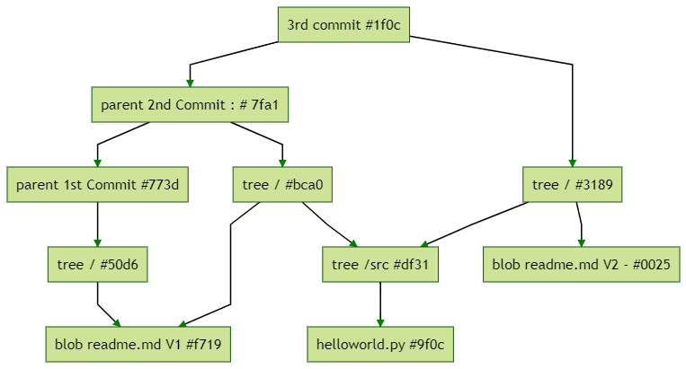

## GIT : How it works

### 1/ Porcelain commands & plumbing commands

The porcelain commands:  
- git add  
- git pull  
- git commit  
- ..  

The plumbing command:  
- git cat-file  
- git hash-object  
- git count-objects  

-----

### 2/ GIT definition  

GIT = Distributed Revision Control System  

GIT =  Persistent Map + Content Tracker + Revision Control System + Distributed Revision Control System  

-----

### 3/ Git objects

The GIT object types:  
- Blob    
- Tree  
- Commit  
- Annoted Tag  

-----

### 4/ First example : first commit

#### 4.1/ Initialize the local repository

We will create a new directory to manipulate the GIT object model. We have to initialize this local repository.

```console
C:\> mkdir GIT-1st-example 
C:\> cd  GIT-1st-example
C:\GIT-1st-example> git init
C:\GIT-1st-example\.git> cd .git
C:\GIT-1st-example\.git> tree /f 
```

We can see the GIT object model:

```console
C:.
│   config
│   description
│   HEAD
│
├───hooks
│       applypatch-msg.sample
│       commit-msg.sample
│       fsmonitor-watchman.sample
│       post-update.sample
│       pre-applypatch.sample
│       pre-commit.sample
│       pre-merge-commit.sample
│       pre-push.sample
│       pre-rebase.sample
│       pre-receive.sample
│       prepare-commit-msg.sample
│       update.sample
│
├───info
│       exclude
│
├───objects
│   ├───info
│   └───pack
└───refs
    ├───heads
    └───tags
```

-----

#### 4.2/ Add yout work to the repository and commit

Now we add a new text file in the directory  

```console
C:\GIT-1st-example\.git> cd..
C:\GIT-1st-example> notepad readme.md
```

And we add this content into the file : "GIT : How it works ?" (save and close notepad)  
And we can notify that GIT has detected a new file :

```console
C:\GIT-1st-example>git status
On branch master

No commits yet

Untracked files:
  (use "git add <file>..." to include in what will be committed)
        readme.md

nothing added to commit but untracked files present (use "git add" to track)
```

But nothing has been adding in the object model :

```console 
C:\GIT-1st-example\> cd .git
C:\GIT-1st-example\.git> tree /f
```

```console
Folder PATH listing for volume Windows
Volume serial number is 7E3E-9A68
C:.
│   config
│   description
│   HEAD
│
├───hooks
│       applypatch-msg.sample
│       commit-msg.sample
│       fsmonitor-watchman.sample
│       post-update.sample
│       pre-applypatch.sample
│       pre-commit.sample
│       pre-merge-commit.sample
│       pre-push.sample
│       pre-rebase.sample
│       pre-receive.sample
│       prepare-commit-msg.sample
│       update.sample
│
├───info
│       exclude
│
├───objects
│   ├───info
│   └───pack
└───refs
    ├───heads
    └───tags
```

And we will add this file. There are different ways : either by naming the file _git add readme.md_ or by doing a adding group _git add ._ (git add _dot_)

```console
C:\GIT-1st-example\.git> cd..
C:\GIT-1st-example> git add .
```

And the status has changed:

```console 
C:\GIT-1st-example> git status
On branch master

No commits yet

Changes to be committed:
  (use "git rm --cached <file>..." to unstage)
        new file:   readme.md
```

And the object model has been updated too. New objects have been added in _objects_ directory: 

```console
C:\GIT-1st-example> cd .git
C:\GIT-1st-example\.git> tree /f
```
   
```console
Folder PATH listing for volume Windows
Volume serial number is 7E3E-9A68
C:.
│   config
│   description
│   HEAD
│   index
│
├───hooks
│       applypatch-msg.sample
│       commit-msg.sample
│       fsmonitor-watchman.sample
│       post-update.sample
│       pre-applypatch.sample
│       pre-commit.sample
│       pre-merge-commit.sample
│       pre-push.sample
│       pre-rebase.sample
│       pre-receive.sample
│       prepare-commit-msg.sample
│       update.sample
│
├───info
│       exclude
│
├───objects
│   ├───f7
│   │       19f6ba8069fff67026125d461f28f9424caed7
│   │
│   ├───info
│   └───pack
└───refs
    ├───heads
    └───tags
```
       
An object is pair of key-value and the key is the hash of the file. The nade of the node (it's a blob) _f7/19f6ba8069fff67026125d461f28f9424caed7_ is the hash of the file _readme.md_  

Let get the hash code of the _readme.txt_ file. And we use a plumbing command:

```console 
C:\GIT-1st-example\.git> cd..
C:\GIT-1st-example> git hash-oject readme.md
f719f6ba8069fff67026125d461f28f9424caed7
```

And to get the content saved into the blob, we will use another plumbiong command : _git cat-file_ : 

```console
C:\GIT-1st-example> git cat-file -p f719
GIT : How it works ?
```
_Remark:_ you does not need to type all the hash code after _cat-file -p_, but only 4 characters (minimal quantity, but if several blob share the same 4 first characters, you have to type more character in order to identify the blob) 

Commit the current work  

```console
C:\GIT-1st-example> git commit -m "1st commit : add the readme.md file"
```
And GIT returns : 

```console
[master (root-commit) 773d9db] 1st commit : add the readme.md file
 1 file changed, 1 insertion(+)
 create mode 100644 readme.md
```

Check the history :

```console
C:\GIT-1st-example> git log
```
And we get:

```console
commit 773d9db6288817fd69c3b374017b85cd9ef7c1b9 (HEAD -> master)
Author: Olivier Mounicq <mounicq@gmail.com>
Date:   Sat Aug 1 17:23:05 2020 +0200

    1st commit : add the readme.md file
```

As we can see, others GIT objects have been added in the object model:

```console
C:\GIT-1st-example> tree /f .git
```

```console
C:\GIT-1ST-EXAMPLE\.GIT
│   COMMIT_EDITMSG
│   config
│   description
│   HEAD
│   index
│
├───hooks
│       applypatch-msg.sample
│       commit-msg.sample
│       fsmonitor-watchman.sample
│       post-update.sample
│       pre-applypatch.sample
│       pre-commit.sample
│       pre-merge-commit.sample
│       pre-push.sample
│       pre-rebase.sample
│       pre-receive.sample
│       prepare-commit-msg.sample
│       update.sample
│
├───info
│       exclude
│
├───logs
│   │   HEAD
│   │
│   └───refs
│       └───heads
│               master
│
├───objects
│   ├───50
│   │       d6ed774db41e7b84487fbf07b2b6f3ed268ac6
│   │
│   ├───77
│   │       3d9db6288817fd69c3b374017b85cd9ef7c1b9
│   │
│   ├───f7
│   │       19f6ba8069fff67026125d461f28f9424caed7
│   │
│   ├───info
│   └───pack
└───refs
    ├───heads
    │       master
    │
    └───tags
```

-----

#### 4.3/ The object model after the first commit

Let's dicover the object model by starting from the root object : the _commit object_.  
To get the hash code of the 1st commit, let's using the _git log_ command :   

```console
C:\GIT-1st-example> git log
commit 773d9db6288817fd69c3b374017b85cd9ef7c1b9 (HEAD -> master)
Author: Olivier Mounicq <mounicq@gmail.com>
Date:   Sat Aug 1 17:23:05 2020 +0200

    1st commit : add the readme.md file
```

The hash code of the commit object is : 773d9db6288817fd69c3b374017b85cd9ef7c1b9.

```console
C:\GIT-1st-example> git cat-file -p 773d
tree 50d6ed774db41e7b84487fbf07b2b6f3ed268ac6
author Olivier Mounicq <mounicq@gmail.com> 1596295385 +0200
committer Olivier Mounicq <mounicq@gmail.com> 1596295385 +0200

1st commit : add the readme.md file
```

This node has only one child:
- a _tree object_ : 50d6ed774db41e7b84487fbf07b2b6f3ed268ac6  

Let's dig into the _tree_ object :

```console
C:\GIT-1st-example> git cat-file -p 50d6
100644 blob f719f6ba8069fff67026125d461f28f9424caed7    readme.md
```

So the _tree_ has only child : a blob containing the readme.md file

```console
git cat-file -p f719f
GIT : How it works ?
```

So the object model is :


```console
├───objects
│   ├───50
│   │       d6ed774db41e7b84487fbf07b2b6f3ed268ac6  : tree object
│   │
│   ├───77
│   │       3d9db6288817fd69c3b374017b85cd9ef7c1b9  : commit object
│   │
│   ├───f7
│   │       19f6ba8069fff67026125d461f28f9424caed7  : blob object 
│   │
│   ├───info
│   └───pack
```


------

#### 4.4 / Second commit and object model

Now, we will create a new directory named _src_ and we will add a new file named _helloworld.py_ :

```console
C:\GIT-1st-example> mkdir src 
C:\GIT-1st-example> cd src
C:\GIT-1st-example\src> notepad helloworld.py
```

And the file content is :

```py
#!/usr/bin/env python3

print("Hello World!")
```

Let check the update in the GIT object model : 

```console
C:\GIT-1st-example\src> cd ..
C:\GIT-1st-example> git add .
C:\GIT-1st-example\> git commit -m "2nd commit : add the python file"
C:\GIT-1st-example> cd .git
C:\GIT-1st-example\.git> tree /f 
```

And we can see that some objects have been added in the _objects_ subdirectory:

```console
Folder PATH listing for volume Windows
Volume serial number is 7E3E-9A68
C.
│   COMMIT_EDITMSG
│   config
│   description
│   HEAD
│   index
│
├───hooks
│       applypatch-msg.sample
│       commit-msg.sample
│       fsmonitor-watchman.sample
│       post-update.sample
│       pre-applypatch.sample
│       pre-commit.sample
│       pre-merge-commit.sample
│       pre-push.sample
│       pre-rebase.sample
│       pre-receive.sample
│       prepare-commit-msg.sample
│       update.sample
│
├───info
│       exclude
│
├───logs
│   │   HEAD
│   │
│   └───refs
│       └───heads
│               master
│
├───objects
│   ├───50
│   │       d6ed774db41e7b84487fbf07b2b6f3ed268ac6
│   │
│   ├───77
│   │       3d9db6288817fd69c3b374017b85cd9ef7c1b9
│   │
│   ├───7f
│   │       a1839dddcb6166f90d2eb4cb0429cfdef94edc
│   │
│   ├───9f
│   │       0c98d2a3e28f6e982067535699136a573385a9
│   │
│   ├───bc
│   │       a043fe83ede3a8d5385e723dccec4b74dd15c6
│   │
│   ├───df
│   │       311d344734adc6e7cbea60c3e31987f855a9fe
│   │
│   ├───f7
│   │       19f6ba8069fff67026125d461f28f9424caed7
│   │
│   ├───info
│   └───pack
└───refs
    ├───heads
    │       master
    │
    └───tags
```

Let start by the root object. For do that, we will use the second commit : 

```command
C:\GIT-1st-example> git log
```

```command
commit 7fa1839dddcb6166f90d2eb4cb0429cfdef94edc (HEAD -> master)
Author: Olivier Mounicq <mounicq@gmail.com>
Date:   Sat Aug 1 22:36:07 2020 +0200

    2nd commit : add the python file

commit 773d9db6288817fd69c3b374017b85cd9ef7c1b9
Author: Olivier Mounicq <mounicq@gmail.com>
Date:   Sat Aug 1 17:23:05 2020 +0200

    1st commit : add the readme.md file
```

There are 2 commits.

The commit had a related hash code : _7fa1839dddcb6166f90d2eb4cb0429cfdef94edc_ . Let discover what this blob contains :

```command
C:\GIT-1st-example> git cat-file -p 7fa1
```
So this blob is a _commit_ and it contains a tree _bca043fe83ede3a8d5385e723dccec4b74dd15c6_

```command
tree bca043fe83ede3a8d5385e723dccec4b74dd15c6
parent 773d9db6288817fd69c3b374017b85cd9ef7c1b9
author Olivier Mounicq <mounicq@gmail.com> 1596314167 +0200
committer Olivier Mounicq <mounicq@gmail.com> 1596314167 +0200

2nd commit : add the python file
```

This commit has two children:  
- a parent commit : 773d9db6288817fd69c3b374017b85cd9ef7c1b9  => the first commit
- a tree object : bca043fe83ede3a8d5385e723dccec4b74dd15c6

Let's start to verify the content of the parent

```command
C:\GIT-1st-example> git cat-file -p 773d
```

```command
tree 50d6ed774db41e7b84487fbf07b2b6f3ed268ac6
author Olivier Mounicq <mounicq@gmail.com> 1596295385 +0200
committer Olivier Mounicq <mounicq@gmail.com> 1596295385 +0200

1st commit : add the readme.md file
```

Let's check what contains this tree ! 

```command
C:\GIT-1st-example> git cat-file -p bca0
```

Well , there are our first file _readme.md_ and also the _src_ directory.

```command
100644 blob f719f6ba8069fff67026125d461f28f9424caed7    readme.md
040000 tree df311d344734adc6e7cbea60c3e31987f855a9fe    src
```

Let's verify the content of the blob:

```command
C:\GIT-1st-example> git cat-file -p f719
```

And it's our first file without doubt:

```command
GIT : How it works ?
```

Ok. Let's dig the branch of the tree! 

```command
C:\GIT-1st-example> git cat-file -p df31
```

And we get that:

```command
100644 blob 9f0c98d2a3e28f6e982067535699136a573385a9    helloworld.py
```


And finally, we have the python file:

```command
C:\GIT-1st-example> git cat-file -p 9f0c
```

```command
#!/usr/bin/env python3

print("Hello World!")
```

So the object model is :

```command
├───objects
│   ├───50
│   │       d6ed774db41e7b84487fbf07b2b6f3ed268ac6  : root tree object of the first commit
│   │
│   ├───77
│   │       3d9db6288817fd69c3b374017b85cd9ef7c1b9  : the first commit node (the parent node)
│   │
│   ├───7f
│   │       a1839dddcb6166f90d2eb4cb0429cfdef94edc  : the second commit node
│   │
│   ├───9f
│   │       0c98d2a3e28f6e982067535699136a573385a9  : the src/helloworld.py blob
│   │
│   ├───bc
│   │       a043fe83ede3a8d5385e723dccec4b74dd15c6  : the tree node (1st level of the tree)
│   │
│   ├───df
│   │       311d344734adc6e7cbea60c3e31987f855a9fe  : the tree node (2nd level of the tree : /src)
│   │
│   ├───f7
│   │       19f6ba8069fff67026125d461f28f9424caed7  : readme.md blob
```


#### 4.5/ Third commit

Now we want to update the _readme.md_ file. Update the first line in the _readme.md_ file : ```# GIT : How it works ?```

```command
C:\GIT-1st-example> git add readme.md
C:\GIT-1st-example> git commit -m "3rd commit : update the readme.md file"
C:\GIT-1st-example> git log -1
```

As we can see, the files containing in the _src_ subtree have not changed, therefore the 3rd commit's object model uses the same reference.

```command
├───objects
│   ├───00
│   │       2573cd5879ba3369abf2f63bfd50e31cd7bb9e  : blob readme.md V2 (the 3rd commit)
│   │
│   ├───1f
│   │       0c4f2bba806387fc7e8c497dcdb5e5f88f2eda  : 3rd commit
│   │
│   ├───31
│   │       89bdb95de4fbb73d8202f9e6d4a72f42550551  : tree / (the 3rd commit)
│   │
│   ├───50
│   │       d6ed774db41e7b84487fbf07b2b6f3ed268ac6  : tree / (1st commit)
│   │
│   ├───77
│   │       3d9db6288817fd69c3b374017b85cd9ef7c1b9  : 1st commit 
│   │
│   ├───7f
│   │       a1839dddcb6166f90d2eb4cb0429cfdef94edc  : 2 nd commit
│   │
│   ├───9f
│   │       0c98d2a3e28f6e982067535699136a573385a9  : helloworld.py (2nd and 3rd commit)
│   │
│   ├───bc
│   │       a043fe83ede3a8d5385e723dccec4b74dd15c6  : tree / (2nd commit)
│   │
│   ├───df
│   │       311d344734adc6e7cbea60c3e31987f855a9fe  : tree /src (shared object : 2nd and 3rd commit)
│   │
│   ├───f7
│   │       19f6ba8069fff67026125d461f28f9424caed7  : blob readme.md V1 (shared object : 1st and 2nd commit)
│   │
│   ├───info
│   └───pack
```





-----
-----
-----

### 5/ HEAD

#### 5.1/ Branch

A branch = just a reference to a commit.  

Up to now, there is only one branch : the _master_ branch. The branches are located in .git/refs/heads/.  
If you want to know   

Windows command:
```command
C:\GIT-1st-example> more .git\refs\heads\master
1f0c4f2bba806387fc7e8c497dcdb5e5f88f2eda
```

Linux or Mac command
```command
olivier~GIT-1st-example> cat .git\refs\heads\master
```

The _master_ branch points to the last commit : 1f0c4f2bba806387fc7e8c497dcdb5e5f88f2eda

```command
C:\GIT-1st-example> git log -1
commit 1f0c4f2bba806387fc7e8c497dcdb5e5f88f2eda (HEAD -> master)
Author: Olivier Mounicq <mounicq@gmail.com>
Date:   Sat Aug 1 23:42:45 2020 +0200

    3rd commit : update the readme.md file
```

-----

#### 5.2/ HEAD

The HEAD contains the current branch.  
 When we do a checkout, we move the HEAD pointer and update the working area.  
 
 After the 3rd commit, we have only two files:
 
 ```command
 C:\GIT-2nd-example\readme.md
 C:\GIT-2nd-example\src\helloworld.py
 ```
 
 Let's check out the first commit by using its hash code:
 
 
```command
C:\GIT-1st-example> git log
commit 1f0c4f2bba806387fc7e8c497dcdb5e5f88f2eda (HEAD -> master)
Author: Olivier Mounicq <mounicq@gmail.com>
Date:   Sat Aug 1 23:42:45 2020 +0200

    3rd commit : update the readme.md file

commit 7fa1839dddcb6166f90d2eb4cb0429cfdef94edc
Author: Olivier Mounicq <mounicq@gmail.com>
Date:   Sat Aug 1 22:36:07 2020 +0200

    2nd commit : add the python file

commit 773d9db6288817fd69c3b374017b85cd9ef7c1b9
Author: Olivier Mounicq <mounicq@gmail.com>
Date:   Sat Aug 1 17:23:05 2020 +0200

    1st commit : add the readme.md file
```

And notify this information : __HEAD -> master__ So the HEAD point to the master


So the first commit hash code is 773d. 

```command
C:\GIT-1st-example> git checkout 773d
```

And GIT returns


```command
Note: switching to '773d'.

You are in 'detached HEAD' state. You can look around, make experimental
changes and commit them, and you can discard any commits you make in this
state without impacting any branches by switching back to a branch.

If you want to create a new branch to retain commits you create, you may
do so (now or later) by using -c with the switch command. Example:

  git switch -c <new-branch-name>

Or undo this operation with:

  git switch -

Turn off this advice by setting config variable advice.detachedHead to false

HEAD is now at 773d9db 1st commit : add the readme.md file
```

Now the HEAD pointer is detached from the master branch.

And the content of the directory C:\1st-GIT-Example has been reloaded with the data linked to the 1st commit: 

```command
C:\GIT-1st-example> dir /b
readme.md
```

And there is only one commit in the history log

```command
C:\GIT-1st-example> git log
commit 773d9db6288817fd69c3b374017b85cd9ef7c1b9 (HEAD)
Author: Olivier Mounicq <mounicq@gmail.com>
Date:   Sat Aug 1 17:23:05 2020 +0200

    1st commit : add the readme.md file
```


And back to _master_ branch

```command
C:\GIT-1st-example> git checkout master
```
And the _src_ subdirectory has been reloaded

```command
C:\GIT-1st-example> dir /b
readme.md
src
```

And we get back the full history log :

```command
C:\GIT-1st-example> git log
commit 773d9db6288817fd69c3b374017b85cd9ef7c1b9 (HEAD)
Author: Olivier Mounicq <mounicq@gmail.com>
Date:   Sat Aug 1 17:23:05 2020 +0200

    1st commit : add the readme.md file

C:\GIT-2nd-example>git checkout master
Previous HEAD position was 773d9db 1st commit : add the readme.md file
Switched to branch 'master'

C:\GIT-2nd-example>git log
commit 1f0c4f2bba806387fc7e8c497dcdb5e5f88f2eda (HEAD -> master)
Author: Olivier Mounicq <mounicq@gmail.com>
Date:   Sat Aug 1 23:42:45 2020 +0200

    3rd commit : update the readme.md file

commit 7fa1839dddcb6166f90d2eb4cb0429cfdef94edc
Author: Olivier Mounicq <mounicq@gmail.com>
Date:   Sat Aug 1 22:36:07 2020 +0200

    2nd commit : add the python file

commit 773d9db6288817fd69c3b374017b85cd9ef7c1b9
Author: Olivier Mounicq <mounicq@gmail.com>
Date:   Sat Aug 1 17:23:05 2020 +0200

    1st commit : add the readme.md file
```

-----
-----
-----

### 6/ Branching & merging

#### 6.1/ Branch definition

A branch = just a reference to a commit. 

#### 6.2/ Command to get all branches

And the command to get all branches : _git branch_

```command
C:\GIT-1st-example> git branch
* master
```

#### 6.3/ New branch

Now we will create a new branch : DEV-01

```command
C:\GIT-1st-example> git branch DEV-01
```
The new branch has been created but out workspace is the master branch's workspace:

```command
C:\GIT-1st-example> git branch
  DEV-01
* master
```

And then we checkout the new branch

```command
C:\GIT-1st-example> git checkout DEV-01
Switched to branch 'DEV-01'
```

We create a new subdirectory called _core_

```command
C:\GIT-1st-example> mkdir core
C:\GIT-1st-example> notepad core\main.py
```

And the content of the file is :

```py
g = input("Enter your name : ") 
print (g)
```

```command
C:\GIT-1st-example> git add .
C:\GIT-1st-example> git commit -m "DEV-01 - add main.py"
```

And let's check the history : 
```command
C:\GIT-1st-example> git log -1
commit 36f74a7cbad54e1e505d0709f9d0c3e0ac02c1dd (HEAD -> DEV-01)
Author: Olivier Mounicq <mounicq@gmail.com>
Date:   Sun Aug 2 21:24:05 2020 +0200

    DEV-01 - add main.py
```

Let's go back to _master_ branch

```command
C:\GIT-1st-example> git checkout master
C:\GIT-1st-example> notepad project.md
```

And the content of the file _project.md_ is 

```txt
#Project
```

```command
C:\GIT-1st-example> git add .
C:\GIT-1st-example> git commit -m "4th commit : add the project"
```

```command
C:\GIT-1st-example> git log -1
commit 6e1e779060d8b69f23463a56c2b8a3e90b32deec (HEAD -> master)
Author: Olivier Mounicq <mounicq@gmail.com>
Date:   Sun Aug 2 21:42:21 2020 +0200

    4th commit : add the project
```

So the commits are:  
- branch DEV-01 : 36f74a7cbad54e1e505d0709f9d0c3e0ac02c1dd  
- master        : 6e1e779060d8b69f23463a56c2b8a3e90b32deec  


#### 6.3/ Merging 

```command
C:\GIT-1st-example> git checkout DEV-01
```

And we merge the _master_ branch into the _DEV-01_ branch  

```command
C:\GIT-1st-example> git merge master
```

GIT returns:

```command
Merge made by the 'recursive' strategy.
 project.md | 1 +
 1 file changed, 1 insertion(+)
 create mode 100644 project.md
 ```
 
 And let's verify that the commit from master has been merged into the _DEV-01_ branch :
 
 ```command
C:\GIT-1st-example> dir /b
core
project.md
readme.md
src
```
 => the file _project.md_ file has been added in the DEV-01 _branch_
 
 
 And the history log ::
 
```command
C:\GIT-1st-example> git log
commit 4ad6782f961b7c048aa31f33d34533df93feccda (HEAD -> DEV-01)
Merge: 36f74a7 6e1e779
Author: Olivier Mounicq <mounicq@gmail.com>
Date:   Sun Aug 2 22:31:01 2020 +0200

    Merge branch 'master' into DEV-01

commit 6e1e779060d8b69f23463a56c2b8a3e90b32deec (master)
Author: Olivier Mounicq <mounicq@gmail.com>
Date:   Sun Aug 2 21:42:21 2020 +0200

    4th commit : add the project

commit 36f74a7cbad54e1e505d0709f9d0c3e0ac02c1dd
Author: Olivier Mounicq <mounicq@gmail.com>
Date:   Sun Aug 2 21:24:05 2020 +0200

    DEV-01 - add main.py

commit 1f0c4f2bba806387fc7e8c497dcdb5e5f88f2eda
Author: Olivier Mounicq <mounicq@gmail.com>
Date:   Sat Aug 1 23:42:45 2020 +0200

    3rd commit : update the readme.md file

commit 7fa1839dddcb6166f90d2eb4cb0429cfdef94edc
Author: Olivier Mounicq <mounicq@gmail.com>
Date:   Sat Aug 1 22:36:07 2020 +0200

    2nd commit : add the python file

commit 773d9db6288817fd69c3b374017b85cd9ef7c1b9
Author: Olivier Mounicq <mounicq@gmail.com>
Date:   Sat Aug 1 17:23:05 2020 +0200

    1st commit : add the readme.md file
```

So the commits are :  
- Merge branch 'master' into DEV-01 : 4ad6782f961b7c048aa31f33d34533df93feccda  
- 4th commit : add the project : 6e1e779060d8b69f23463a56c2b8a3e90b32deec  
-  DEV-01 - add main.py : 36f74a7cbad54e1e505d0709f9d0c3e0ac02c1dd  
- 3rd commit : update the readme.md file : 1f0c4f2bba806387fc7e8c497dcdb5e5f88f2eda  
- 2nd commit : add the python file : 7fa1839dddcb6166f90d2eb4cb0429cfdef94edc  
- 1st commit : add the readme.md file : 773d9db6288817fd69c3b374017b85cd9ef7c1b9  

And now we go back to the _master_ branch and we merge the _DEV-01_ branch into the master: 

```command
C:\GIT-1st-example> git checkout master
```

And let's verify that the subdirectory _core_ is not present yet :

```command
C:\GIT-1st-example> dir /b
project.md
readme.md
src
```
 
Now we retrieve the commit from _DEV-01_ to _master_ branch :

```command
C:\GIT-1st-example> git merge DEV-01
Updating 6e1e779..4ad6782
Fast-forward
 core/main.py | 2 ++
 1 file changed, 2 insertions(+)
 create mode 100644 core/main.py
```

And the history is :

```command
C:\GIT-1st-example> git log
commit 4ad6782f961b7c048aa31f33d34533df93feccda (HEAD -> master, DEV-01)
Merge: 36f74a7 6e1e779
Author: Olivier Mounicq <mounicq@gmail.com>
Date:   Sun Aug 2 22:31:01 2020 +0200

    Merge branch 'master' into DEV-01

commit 6e1e779060d8b69f23463a56c2b8a3e90b32deec
Author: Olivier Mounicq <mounicq@gmail.com>
Date:   Sun Aug 2 21:42:21 2020 +0200

    4th commit : add the project

commit 36f74a7cbad54e1e505d0709f9d0c3e0ac02c1dd
Author: Olivier Mounicq <mounicq@gmail.com>
Date:   Sun Aug 2 21:24:05 2020 +0200

    DEV-01 - add main.py

commit 1f0c4f2bba806387fc7e8c497dcdb5e5f88f2eda
Author: Olivier Mounicq <mounicq@gmail.com>
Date:   Sat Aug 1 23:42:45 2020 +0200

    3rd commit : update the readme.md file

commit 7fa1839dddcb6166f90d2eb4cb0429cfdef94edc
Author: Olivier Mounicq <mounicq@gmail.com>
Date:   Sat Aug 1 22:36:07 2020 +0200

    2nd commit : add the python file

commit 773d9db6288817fd69c3b374017b85cd9ef7c1b9
Author: Olivier Mounicq <mounicq@gmail.com>
Date:   Sat Aug 1 17:23:05 2020 +0200

    1st commit : add the readme.md file
```

#### 6.4/ The object model after the merge

Let's have a look on the object model after the merge. The last commit's hash is _4ad6_ (Merge branch 'master' into DEV-01).

```command
C:\GIT-1st-example> git cat-file -p 4ad6
tree a39f32d01f83d3f3369d2032086d9163e1c4a60b
parent 36f74a7cbad54e1e505d0709f9d0c3e0ac02c1dd
parent 6e1e779060d8b69f23463a56c2b8a3e90b32deec
author Olivier Mounicq <mounicq@gmail.com> 1596400261 +0200
committer Olivier Mounicq <mounicq@gmail.com> 1596400261 +0200

Merge branch 'master' into DEV-01
```

And you can notice that this commit has _two parents_ :  
- 36f7 : the commit _DEV-01 - add main.py_
- 6e1e : the commit _4th commit : add the project_  


 


